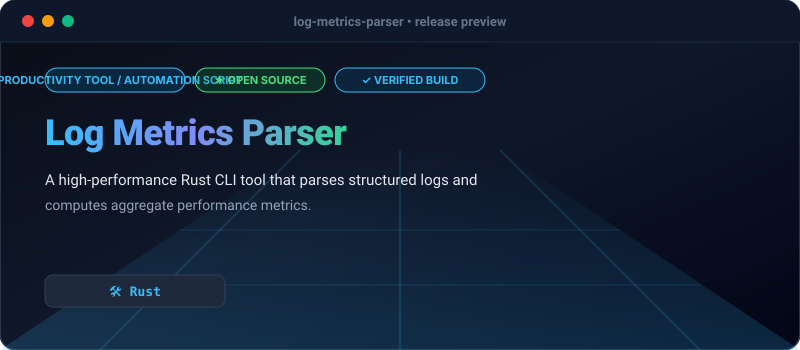

# Log Metrics Parser

`log-metrics-parser` is a command-line utility written in Rust designed to ingest JSON-structured log streams, filter entries by severity or latency thresholds, and output aggregate performance summaries.

## Key Capabilities

- **Stream Processing**: High-throughput stdin or file log ingestion.
- **Prometheus Export**: Export metrics directly in Prometheus text exposition format.
- **Time-Window Filtering**: Filter logs efficiently using `--start-time` and `--end-time`.
- **Latency Percentiles**: Calculates p50, p90, p99, mean, and max latencies.
